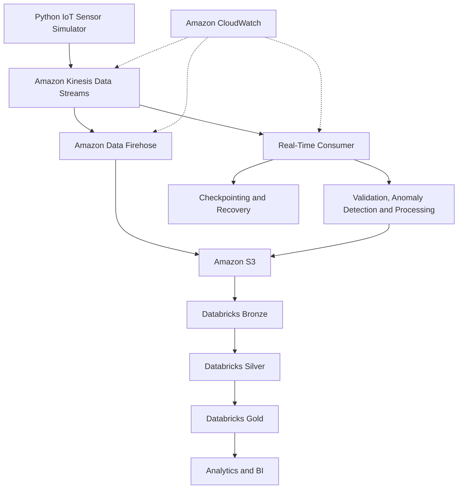

# Stadium IoT Real-Time Data Platform

A production-inspired, end-to-end real-time data engineering project that simulates stadium IoT telemetry and processes it using AWS streaming services, Amazon S3, and Databricks.

The project focuses on more than data ingestion. It explores **reliability, fault tolerance, data integrity, recovery, event-time processing, observability, and scalable data architecture**.

> **Status:** In development. The existing Python sensor simulator is a separate project. AWS streaming, storage, processing, and operational capabilities are planned for implementation.

## Project Objectives

* Simulate IoT telemetry from multiple stadiums, zones, and sensor types.
* Ingest events in real time using Amazon Kinesis Data Streams.
* Handle transient failures, retries, duplicate delivery, and delayed events.
* Implement consumer checkpointing, recovery, and replay.
* Preserve historical data in Amazon S3.
* Process data through Bronze, Silver, and Gold layers in Databricks.
* Implement data quality, reconciliation, and completeness checks.
* Monitor pipeline health, processing lag, and failures.
* Automate infrastructure deployment using Terraform.
* Validate the platform through controlled failure and recovery exercises.

## Architecture



The architecture is a target design. Components will be introduced incrementally and documented as they are implemented.

## Technology Stack

| Layer                  | Technology                       |
| ---------------------- | -------------------------------- |
| Programming            | Python                           |
| Streaming              | Amazon Kinesis Data Streams      |
| Stream delivery        | Amazon Data Firehose             |
| Cloud storage          | Amazon S3                        |
| Data format            | JSON, Parquet                    |
| Data processing        | Databricks, PySpark, SQL         |
| Data architecture      | Medallion (Bronze, Silver, Gold) |
| Infrastructure as Code | Terraform                        |
| Monitoring             | Amazon CloudWatch                |
| Version control        | Git and GitHub                   |

## Core Engineering Requirements

### Reliability and Fault Tolerance

* Retry transient publishing failures using bounded exponential backoff.
* Handle network interruptions, throttling, and service errors.
* Assess durable producer-side buffering for outages.
* Recover consumers from checkpoints.
* Support replay and historical backfills.
* Handle partial failures without silently losing records.

### Data Integrity

* Assign a stable unique `event_id` to each logical event.
* Use suitable Kinesis partition keys.
* Design downstream writes to be idempotent.
* Deduplicate repeated events.
* Track event time separately from ingestion and processing time.
* Detect malformed, missing, duplicated, and late-arriving records.

### Checkpointing and Watermarks

* Track consumer progress and resume from known positions.
* Advance checkpoints only after successful processing or durable handoff.
* Use event-time watermarks in compatible processing engines to manage late-arriving data.
* Distinguish stream offsets, event IDs, checkpoints, and watermarks.
* Define behavior for events that arrive beyond the allowed lateness window.

### Recovery and Replay

* Configure appropriate Kinesis retention.
* Retain historical data in S3 to enable downstream recovery.
* Support controlled replay and reprocessing.
* Prevent replay from generating duplicate logical records.
* Document recovery limits and test outage scenarios.

### Monitoring and Data Quality

* Monitor producer throughput, retries, and failures.
* Monitor stream throughput and consumer lag.
* Track delivery failures and processing latency.
* Reconcile event counts across pipeline stages.
* Detect unexpected volume drops, missing intervals, and duplicate events.
* Configure actionable alerts and operational dashboards.

### Security and Infrastructure

* Use IAM roles and least-privilege permissions.
* Keep credentials and secrets out of source control.
* Encrypt data in transit and at rest.
* Manage cloud infrastructure using Terraform.
* Parameterize configuration across environments.
* Document deployment, teardown, and cost considerations.

## Data Flow

1. The Python simulator generates synthetic sensor readings.
2. Events are published to Amazon Kinesis Data Streams.
3. Consumers read events for validation, processing, and anomaly identification.
4. Consumer progress is tracked to support restart and recovery.
5. Amazon Data Firehose or a justified custom delivery path stores streaming data in S3.
6. Databricks ingests historical data into the Bronze layer.
7. Silver transformations validate, normalize, deduplicate, and handle late or corrected records.
8. Gold transformations produce analytics-ready datasets.

## Data Layers

| Layer  | Purpose                                                         |
| ------ | --------------------------------------------------------------- |
| Bronze | Preserve raw ingested events with source and ingestion metadata |
| Silver | Validate, standardize, deduplicate, and transform records       |
| Gold   | Produce business-level metrics and analytical aggregates        |

## Project Structure

```text
stadium-iot-realtime-platform/
├── simulator/             # Integration or reference to the sensor simulator
├── producer/              # Kinesis publishing code
├── consumer/              # Stream consumption and processing
├── infrastructure/        # Terraform configurations
├── storage/               # S3 delivery and storage configurations
├── databricks/             # Bronze, Silver, and Gold workloads
├── tests/                  # Unit, integration, and resilience tests
├── docs/                   # Architecture, decisions, and runbooks
├── PROJECT_CHARTER.md      # Project goals and engineering requirements
├── .gitignore
└── README.md
```

Directories will be added as their corresponding components are implemented.

## Failure and Recovery Testing

The project will validate behavior under scenarios such as:

* Invalid AWS credentials.
* Network timeouts and publishing failures.
* Kinesis throttling.
* Producer or consumer restarts.
* Consumer failures around checkpoint advancement.
* Duplicate delivery and replay.
* Malformed events and schema changes.
* S3 delivery or downstream processing failures.
* Late and out-of-order events.
* Consumer lag and recovery after downtime.

Each exercise should document expected behavior, observed results, recovery steps, and known limitations.

## Implementation Roadmap

* [ ] Create the repository and document the project architecture.
* [ ] Configure AWS authentication and IAM permissions.
* [ ] Provision Kinesis Data Streams using Terraform.
* [ ] Integrate the Python simulator with Kinesis.
* [ ] Implement retries, stable event IDs, and publishing metrics.
* [ ] Build a consumer with validation and checkpointing.
* [ ] Implement idempotent processing, deduplication, and replay.
* [ ] Configure S3 delivery and historical storage.
* [ ] Implement Databricks Bronze, Silver, and Gold layers.
* [ ] Introduce event-time handling and watermarks.
* [ ] Implement monitoring, alerts, and data reconciliation.
* [ ] Perform failure and recovery testing.
* [ ] Document deployment, security, operations, and teardown.

## Design Principles

* **Reliability over happy-path-only processing:** explicitly handle failures and recovery.
* **At-least-once delivery:** design downstream processing to tolerate duplicates.
* **Idempotency:** repeated processing should not create duplicate logical outcomes.
* **Replayability:** retain enough historical data to support recovery and rebuilding.
* **Observability:** make failures, delays, and data-quality issues visible.
* **Incremental implementation:** build and validate each component before adding complexity.
* **Honest guarantees:** do not claim zero data loss or end-to-end exactly-once processing without proving it under defined assumptions.

## Scope and Disclaimer

This is a learning and demonstration project using synthetic IoT telemetry. It does not integrate with physical sensors or actual stadium infrastructure and is not designed for safety-critical operational decisions.

The architecture is production-inspired, but its guarantees and limitations must be validated through testing before making claims about production readiness.

## Author

**Faizal Ahmed**

GitHub: [faizal4757](https://github.com/faizal4757)
